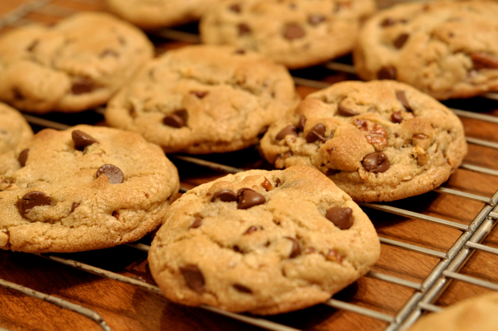

# JS Cookie Clicker

- Official Cookie Clicker: <http://orteil.dashnet.org/cookieclicker/>
- CERN Particle Clicker: <https://particle-clicker.web.cern.ch/particle-clicker/>

## Level 1: _Basic structure_
Make the *HTML* / *CSS* / *JS* basic structure. In *HTML*, make a `button` with a "click" and identify a `div` with an *ID* `display` with initial value of `0`.

## Level 2: _Create the basic JS_
Write the head of *JS* variables that allow us to manipulate our `button` and our `div`. We will also need a `score` variable for resulted score and has initial value of `0`.

## Level 3: _Score increament_
When you click the button, it will increase the variable `score` by `1`, and then display it in the score display `div`.

## Level 4: _Multiplier creation_
Add a `button` with the *ID* `multiply`. Create a click counter as variable and name it `multiplier` with value equal to `1`). After that create a`function` associated with the click multiplier called `augmenterMultiplicateur`.

## Level 5: _Using the multiplier_
Making the score increase by the value of the multiplier for each click. For example, if I clicked once on the multiplier button, each click on the first button now add `2` instead of `1`.

## Level 6: _Multiplying the price_
The multiplier allows you to gain score faster but this should not be free! For instance each time you click on the multiplier button this will deduct `50` score from your total gained score.

## Level 7: _We don't give credit_
We can not give credit and we don't want to display negative score. Remember to update the display of the score after each purchase!

## Level 8: _Counter display_
Display the multiplier counter inside the `button`. For example, if the counter is equal to `5`, then the button should display
"x5 multiplier".

## Level 9: _Price increament_
Buy full multiplier is too easy. Go back to step 6, you will understand why we should buy more multipliers, plus they are expensive.
For example, the first would be `50`, the following `100`, the following `200`, etc.. No need to complicate your life, do not do full conditions, find another way to change the price!

## Level 10: _Displaying of Price_
Display the price onthe `button`, in addition to counter display like the previouse example which showed  "x5", it has to display the cost of the next purchase next to counter display.

## Level 11: _Autoclicker_
Further improvement to buy is to use: autoclick. Once you have a credit of `200`, an automatic click will be done every second. (`setInterval` is your friend)

## Level 12: _Shopping autoclicker_
The autoclicker will not be automatic. We must now buy the autoclicker. You will add a button with *ID* `autoclic`. It will cost `500`. Once the autoclicker was purchased, it will disable the buy `button` of autoclic.

## Level 13: _Buying a bonus_
Now we must buy a bonus that will increases the scores by `200` for 30 seconds on each click. Each click, score increases by `3` for 30 seconds to score and the bonus will be increased by `6` for each click.
You will create the "BONUS" button with *ID* `bonus`, and the bonus will cost `5000`. When the bonus is purchased, the number of seconds will appear in the button with counter and the button will be disabled during bonus time. When bonus timeout, the button will be reactivated and returns to its original condition.

## Level 14: _Disable buttons (if you don't have scores to buy upgrades)_
Ensure that the multiplier buttons, autoclic and bonuses are not active when there is no enough scores to buy upgrades.

## Level 15: _CSS_
Wheather is beautifull! No pictures!